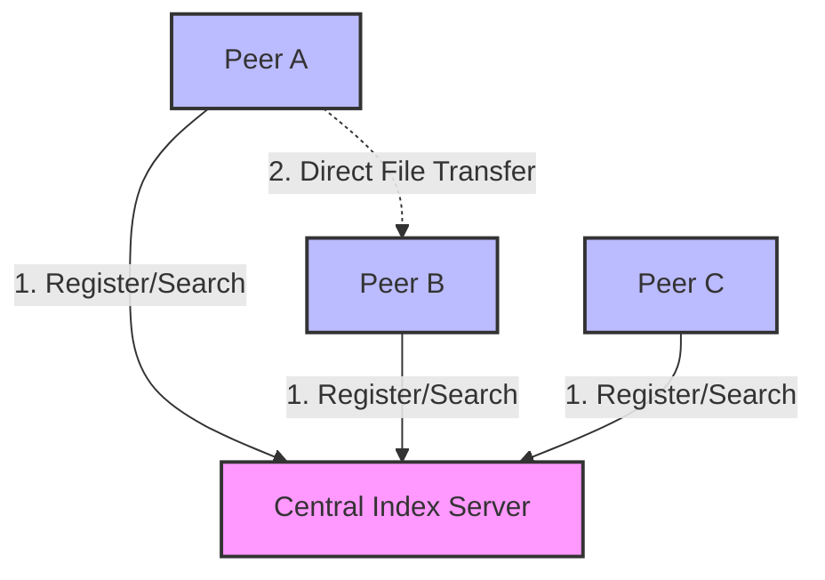

# Napster P2P 🚀
**Secure, Resumable, Cross-Platform File Transfer (Windows, Mac & Android)**

Napster P2P is a local file sharing tool designed to be robust ("The Tunnel"), secure (Fernet Encryption), and user-friendly. It allows you to drag-and-drop files between your Windows PC, Mac, and Android device over WiFi without the cloud.
## 🏗️ System Architecture



## Features
*   **📡 Cross-Platform**: Works on Windows, macOS (Desktop App), and Android (KivyMD App).
*   **🚇 The Tunnel**: Resumable transfers. If your WiFi drops at 99%, it resumes from 99%.
*   **🔒 Encrypted**: All transfers are encrypted with a session key using `cryptography.fernet`.
*   **📊 Visual Progress**: Real-time progress bar for tracking large files.
*   **⚡ Auto-Discovery**: Automatically finds Receivers on the network (UDP Beacon).

## Installation

### Windows
1.  Ensure you have [Python](https://www.python.org/downloads/) installed.
2.  Download this repository.
3.  Install dependencies:
    ```bash
    pip install kivy kivymd cryptography watchdog
    ```
4.  Run the application:
    ```bash
    python main.py
    ```

### Mac (macOS)
1.  Download the latest release (`NapsterP2P.app`).
2.  Move it to your `Applications` folder or `Desktop`.
3.  Double-click to launch.
4.  Alternatively, you can run from source following the Windows instructions (use `python3`).

### Android
*Note: This is a developer build. You must compile the APK yourself using Google Colab.*

1.  Download this repository as a ZIP.
2.  Upload `napster_project.zip` (containing `main.py`, `napster.py`, `buildozer.spec`) to [Google Colab](https://colab.research.google.com/).
3.  Run the following build script:
    ```python
    !unzip -o napster_project.zip
    !pip install buildozer cython==0.29.33
    !sudo apt-get update
    !sudo apt-get install -y build-essential libffi-dev libssl-dev python3-dev \
        autoconf libtool pkg-config zlib1g-dev libncurses5-dev libncursesw5-dev \
        libtinfo5 cmake libtool-bin
    !yes | buildozer android debug
    ```
4.  Download the generated `.apk` and install it.

## Usage

### Receiving (Server)
1.  Go to the **Receive** tab.
2.  Note your **Session Key** (or paste one from the Sender).
3.  Click **START SERVER**.
4.  Files will be saved to your **Downloads/NapsterReceived** folder.

### Sending (Client)
1.  Go to the **Send** tab.
2.  Enter the Receiver's **IP Address** (or click 🔍 to scan).
3.  Ensure the **Key** matches the Receiver.
4.  Select a file and click **SEND FILE**.

## Development
To run locally from source:

```bash
# Install dependencies
pip install kivy kivymd cryptography watchdog

# Run App
python3 main.py
```

## License
MIT License
